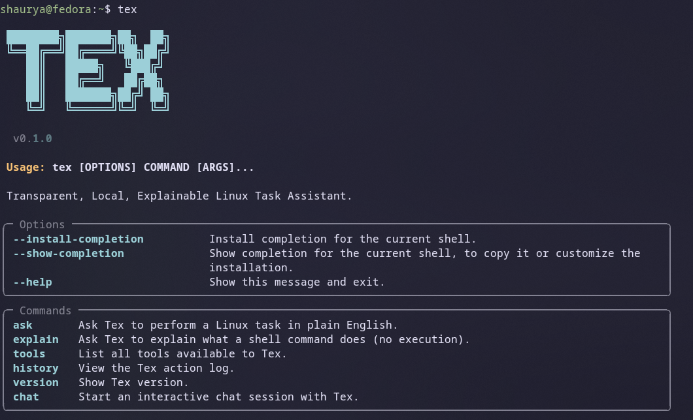
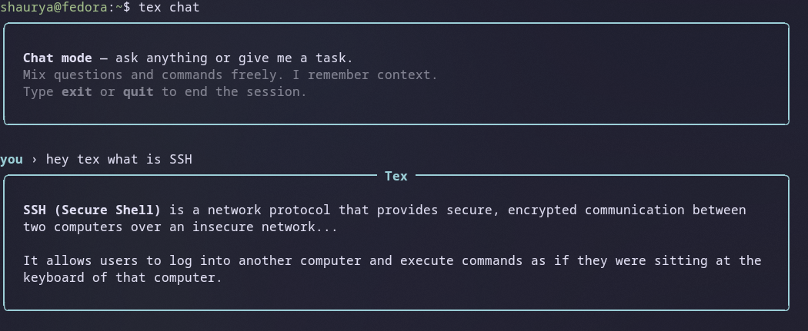
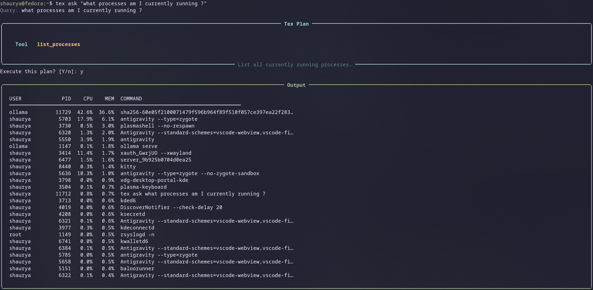

# Tex

> A transparent, local, explainable Linux task assistant.

Tex is a CLI-based orchestrator that interprets your intent in plain English, maps it to safe predefined tools, shows you exactly what it plans to do, asks for confirmation, then executes — and logs everything.

**The LLM never executes commands directly. You are always in control.**

---

> **Status: Active Development**
> This project is a work in progress. Core functionality is stable and usable, but the tool set, chat engine, and overall feature surface are still expanding. Expect rough edges and breaking changes between updates.

---

## Screenshots





---

## Philosophy

- **Local-first.** No cloud. Runs entirely on your machine via [Ollama](https://ollama.com).
- **Explicit over automatic.** Tex always shows what it is going to do before doing it.
- **Explain before execute.** You understand what is happening, always.
- **Education is a feature.** Tex teaches while it works.
- **User stays in control.** No background daemons. No silent actions. No raw shell from model output.

---

## Quickstart

### 1. Install Ollama and pull a model

```bash
curl -fsSL https://ollama.com/install.sh | sh
ollama pull llama3.2
```

### 2. Install Tex

```bash
git clone https://github.com/Shaurya-34/Tex.git
cd Tex
pip install -e .
```

### 3. Configure

```bash
cp .env.example .env
# Edit .env to set your preferred Ollama model and options
```

### 4. Use it

```bash
tex ask "install zsh"
tex ask "show me what's eating memory"
tex ask "copy /etc/hosts to ~/hosts.bak"
tex explain "journalctl -xe"
tex chat
tex tools
tex history
```

---

## CLI Commands

| Command | Description |
|---|---|
| `tex ask "<task>"` | Ask Tex to perform a Linux task in plain English |
| `tex ask "<task>" --dry-run` | Show the plan without executing anything |
| `tex ask "<task>" --yes` | Skip the confirmation prompt |
| `tex explain "<command>"` | Explain what a shell command does (no execution) |
| `tex chat` | Start an interactive multi-turn chat session |
| `tex tools` | List all available tools with flags and descriptions |
| `tex history` | View the action log |
| `tex version` | Show the current Tex version |

---

## Architecture

```
User Input
    |
    v
LLM (Ollama, local) -- intent classification only
    |
    v
Validator -- schema check, whitelist enforcement
    |
    v
Tool Dispatcher -- Python logic, no raw shell from model
    |
    v
Plan Display -- shown to user before anything runs
    |
    v
Confirmation Prompt -- user explicitly approves
    |
    v
Execution Layer -- subprocess, controlled environment
    |
    v
Logger -- full audit trail in logs/tex.log
```

---

## Available Tools

| Tool | Description | Flags |
|---|---|---|
| `install_package` | Install a package via dnf | sudo |
| `remove_package` | Remove a package via dnf | sudo, destructive |
| `search_package` | Search for packages matching a keyword | - |
| `list_files` | List files in a directory | - |
| `read_file` | Read a file's contents | - |
| `copy_file` | Copy a file from source to destination | - |
| `move_file` | Move or rename a file | destructive |
| `delete_file` | Delete a file permanently | destructive |
| `list_processes` | Show running processes, optionally filtered | - |
| `kill_process` | Kill a process by PID | destructive |
| `read_journal` | Read systemd journal logs | - |
| `get_system_info` | Show CPU, RAM, GPU, disk, and OS info | - |
| `list_installed_packages` | List installed dnf packages, optionally filtered | - |
| `explain_command` | Explain what a shell command does without executing it | - |

All tool calls are validated against this whitelist before dispatch. Any tool name not in this registry is rejected outright.

---

## Chat Mode

`tex chat` starts an interactive multi-turn session. You can mix plain questions and system tasks freely in the same session.

- Conversational input (questions, explanations, general queries) is routed to a streaming chat path using a lightweight system prompt. Responses stream token-by-token to the terminal.
- Task-like input goes through the full LLM validation and execution pipeline, with plan display and confirmation as usual.
- Tex maintains conversation history for up to 10 turns within a session for context continuity.
- Type `exit` or `quit` to end the session.

---

## Safety Rules

1. No raw shell execution from model output. Ever.
2. Only whitelisted tools are allowed to run.
3. Every action is shown to the user before execution.
4. Destructive actions require typing `yes` explicitly — no default confirm.
5. No background daemon. No always-on process.
6. No automatic sudo escalation.
7. Full action log at `logs/tex.log` (excluded from git).
8. Malformed or unexpected LLM output aborts immediately — Tex does not guess.

---

## Stack

- **Python 3.10+**
- **Typer** — CLI framework
- **Rich** — terminal UI, panels, tables, live streaming
- **Pydantic** — tool call schema validation
- **Ollama** — local LLM inference
- **Loguru** — structured action logging
- **python-dotenv** — local configuration

---

## Project Structure

```
tex/
  tex/
    main.py          -- CLI entry point, command definitions
    config.py        -- Configuration loaded from .env
    core/
      dispatcher.py  -- Routes validated tool calls to implementations
      executor.py    -- Plan display, confirmation, execution flow
      logger.py      -- Action and error logging
      validator.py   -- LLM output schema validation
    llm/
      client.py      -- Ollama client, history management, streaming
      prompts.py     -- System prompts for task and chat modes
    tools/
      registry.py    -- Tool whitelist and ToolDefinition schema
      file_ops.py    -- File operation implementations
      packages.py    -- Package management implementations
      processes.py   -- Process inspection implementations
      sysinfo.py     -- System info implementations
  pyproject.toml
  .env.example
  .gitignore
```

---

## Roadmap (planned, not committed)

- apt/pacman support alongside dnf
- Network tools (ping, curl, port checks)
- Cron and systemd service management
- Plugin or user-defined tool support
- Shell history awareness
- Test suite

---

## License

MIT
